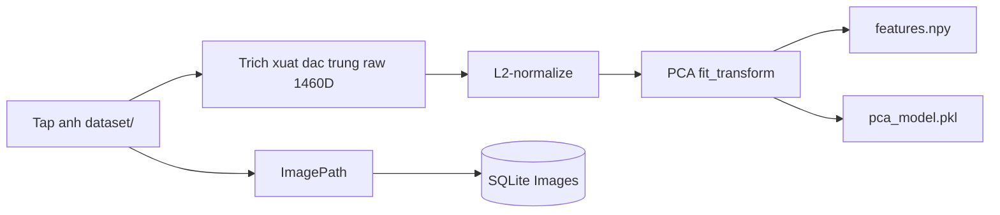
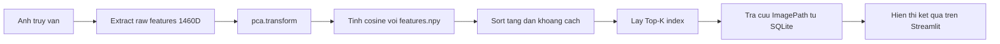

# CHUONG 3: HE THONG VA CO SO DU LIEU

## 3.1. Kien truc tong the

He thong duoc thiet ke theo mo hinh hai giai doan tach biet:

- **Giai doan Offline (xay dung CSDL dac trung):** quet tap anh trong `dataset/`, trich xuat dac trung raw, giam chieu bang PCA, luu CSDL va ma tran dac trung.
- **Giai doan Online (truy van):** nhan anh truy van tu giao dien Streamlit, trich xuat dac trung, chieu qua PCA da huan luyen, tinh do tuong dong cosine voi toan bo CSDL, tra ve Top-K.

### 3.1.1. Cac thanh phan chinh

1. **Module trich xuat dac trung (`feature_extractors.py`)**
   - Dau vao: anh mau.
   - Xu ly: resize ve `224x224`, tao mask foreground (GrabCut + morphology), trich xuat 4 nhom dac trung.
   - Dau ra: vector raw `1460` chieu, da L2-normalize.

2. **Module xay dung CSDL offline (`1_extract_offline.py`)**
   - Quet toan bo anh trong `dataset/`.
   - Luu metadata vao SQLite (`database/database.db`).
   - Gom vector raw, fit PCA (`n_components <= 512`), transform va luu `database/features.npy`.
   - Luu mo hinh PCA vao `database/pca_model.pkl`.

3. **Module truy van online (`2_app.py`)**
   - Tai tai nguyen da tien xu ly: `features.npy`, `pca_model.pkl`, `database.db`.
   - Nguoi dung upload anh truy van.
   - Trich vector raw -> PCA transform -> tinh cosine distance (`scipy.spatial.distance.cdist`).
   - Sap xep tang dan theo khoang cach, hien thi Top-K ket qua.

4. **Tang giao dien nguoi dung**
   - Xay dung bang Streamlit.
   - Cung cap upload anh, chon `Top-K`, xem ket qua va do tuong tu.

### 3.1.2. Luong du lieu tong quan

- **Offline:** `dataset/` -> `extract_raw_features` -> ma tran raw -> `PCA.fit_transform` -> `features.npy`, `pca_model.pkl`, `database.db`.
- **Online:** `query image` -> `extract_raw_features` -> `pca.transform` -> cosine voi `features.npy` -> tra ve danh sach duong dan anh tu `database.db`.

---

## 3.2. Schema co so du lieu

He thong su dung **SQLite** de luu metadata anh (khong luu vector trong bang SQL).  
Vector dac trung duoc luu dang ma tran Numpy de toi uu toc do truy cap.

### 3.2.1. Bang du lieu

Bang duy nhat trong `database/database.db`:

```sql
CREATE TABLE IF NOT EXISTS Images (
    ImageID   INTEGER PRIMARY KEY AUTOINCREMENT,
    ImagePath TEXT    NOT NULL UNIQUE
);
```

### 3.2.2. Y nghia cac truong

- `ImageID`: khoa chinh, tu tang, dinh danh duy nhat cho moi anh.
- `ImagePath`: duong dan tuong doi toi file anh trong du an; rang buoc `UNIQUE` de tranh trung lap.

### 3.2.3. Mo hinh luu tru ket hop

He thong luu du lieu theo kien truc lai:

1. **SQLite (`database.db`)**
   - Luu quan he: `ImageID` <-> `ImagePath`.
   - Ho tro truy vet ten file/duong dan de hien thi.

2. **Numpy (`features.npy`)**
   - Luu ma tran dac trung da PCA kich thuoc `(N, D')`, trong do `D' <= 512`.
   - Toi uu cho tinh toan vector hoa khi truy van.

3. **Pickle (`pca_model.pkl`)**
   - Luu mo hinh PCA da huan luyen.
   - Dam bao online suy dien dong nhat voi offline.

### 3.2.4. Quan he logic giua cac tep

- Dong thu `i` trong `features.npy` tuong ung ban ghi co thu tu `ORDER BY ImageID` trong bang `Images`.
- App online doc `ImagePath` theo thu tu `ImageID`, sau do map theo chi so ket qua tu phep sap xep cosine.

---

## 3.3. So do khoi quy trinh tim kiem

### 3.3.1. So do khoi giai doan offline



### 3.3.2. So do khoi giai doan online



### 3.3.3. Mo ta thuat toan truy van

Cho vector truy van sau PCA la `q` va ma tran CSDL la `X = {x_i}`:

\[
d_i = 1 - \frac{q \cdot x_i}{\|q\|_2\|x_i\|_2}
\]

Sap xep `d_i` tang dan va lay `Top-K` phan tu nho nhat.

Do tuong tu hien thi tren giao dien:

\[
sim_i = (1 - d_i)\times 100\%
\]

---

## 3.4. Cac ky thuat toi uu hoa

Phan nay mo ta cac ky thuat toi uu da duoc ap dung trong code hien tai.

### 3.4.1. Tien tinh offline thay vi tinh online

- Toan bo anh CSDL duoc trich xuat dac trung va PCA **truoc**.
- Khi truy van, he thong chi can:
  - trich xuat 1 vector query,
  - chieu PCA,
  - so khop voi ma tran da co.
- Loi ich: giam manh do tre online.

### 3.4.2. Giam chieu PCA de toi uu toc do va bo nho

- Vector raw ban dau: `1460` chieu.
- Sau PCA: toi da `512` chieu (thuc te la `min(512, so_mau, 1460)`).
- Tac dong:
  - giam chi phi tinh cosine,
  - giam dung luong luu tru ma tran dac trung,
  - han che nhieu thong ke.

### 3.4.3. Co che resume/checkpoint khi offline extraction

`1_extract_offline.py` ho tro tiep tuc sau khi bi gian doan:

- Kiem tra cac `ImagePath` da ton tai trong SQLite de bo qua anh da xu ly.
- Dinh ky moi `CHECKPOINT_EVERY = 20` anh:
  - `commit` SQLite,
  - luu tam `raw_features.npy`.
- Khi chay lai, nap checkpoint de tiep tuc thay vi tinh lai tu dau.

### 3.4.4. Toi uu truy xuat tai nguyen trong app

- Dung `@st.cache_resource` de cache:
  - ma tran `features.npy`,
  - model PCA,
  - danh sach `ImagePath`.
- Tranh tai lai tep lon sau moi lan tuong tac giao dien.

### 3.4.5. Ve sinh va an toan so hoc

- Dung `np.nan_to_num(...)` de xu ly `NaN/Inf` trong vector.
- Chuan hoa L2 truoc khi so khop de tao tinh dong nhat thang do.
- Cac ham dac trung co co che fallback/zero vector khi gap loi (doc anh loi, mask rong, tinh toan that bai).

### 3.4.6. Tien xu ly mask de tang chat luong dac trung

- Segment foreground bang GrabCut.
- Lam sach mask bang morphology opening/closing.
- Loi ich:
  - dac trung tap trung vao doi tuong chim,
  - giam anh huong nen phuc tap.

### 3.4.7. Ranh gioi toi uu hien tai

He thong dang dung `argsort` tren toan bo tap dac trung de lay Top-K, phu hop tap vua/nho.  
Voi tap rat lon, co the nang cap bang ANN (FAISS/Annoy) de toi uu hon nua.

---

## 3.5. Ung dung demo

Ung dung demo duoc trien khai bang **Streamlit** (`2_app.py`) nham trinh dien toan bo quy trinh CBIR.

### 3.5.1. Chuc nang chinh

- Upload anh truy van (`jpg`, `jpeg`, `png`, `bmp`, `webp`).
- Chon so luong ket qua `Top-K` (1 den 20).
- Hien thi:
  - anh truy van,
  - danh sach anh tuong tu,
  - ti le tuong tu (%) cho tung ket qua.

### 3.5.2. Quy trinh xu ly trong giao dien

1. Kiem tra su ton tai cua:
   - `database/database.db`
   - `database/features.npy`
   - `database/pca_model.pkl`
2. Nguoi dung tai anh.
3. Luu tam anh upload ra tep tam de OpenCV doc.
4. Goi `extract_raw_features(...)` de tao vector truy van.
5. Chieu `pca.transform(...)`.
6. Tinh cosine distance den toan bo CSDL va lay Top-K.
7. Anh xa index ket qua sang `ImagePath`, hien thi anh.

### 3.5.3. Gia tri trinh dien va kha nang mo rong

- Demo giup kiem chung day du pipeline offline/online trong dieu kien thuc te.
- Kien truc module ro rang, de mo rong:
  - bo dac trung moi,
  - metric moi (euclidean, chi-square),
  - giao dien nang cao (loc theo loai chim, metadata, phan hoi nguoi dung).

---

## Tieu ket Chuong 3

Chuong nay da trinh bay kien truc he thong CBIR theo mo hinh hai giai doan, schema CSDL metadata bang SQLite, quy trinh truy van theo so do khoi, cac ky thuat toi uu dang duoc ap dung, va ung dung demo Streamlit.  
Nho su ket hop giua trich xuat dac trung co dien, PCA, va co che so khop cosine, he thong dat su can bang giua do chinh xac, toc do va kha nang trien khai thuc te.
