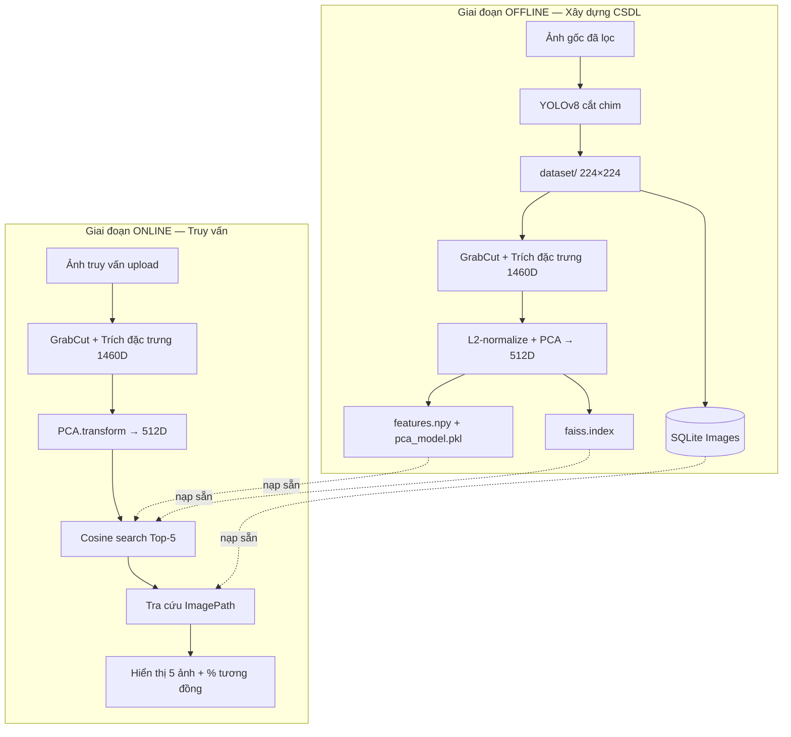
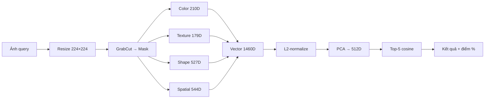

# Hệ thống Tìm kiếm Ảnh Chim (Bird Image Search System)

Hệ thống **CBIR (Content-Based Image Retrieval)** tìm kiếm ảnh chim tương đồng dựa trên nội dung hình ảnh, sử dụng các đặc trưng Computer Vision cổ điển (không dùng Deep Learning cho bước trích xuất đặc trưng). Đầu vào là một ảnh chim bất kỳ; đầu ra là **5 ảnh giống nhất** trong cơ sở dữ liệu, xếp theo độ tương đồng giảm dần.

---

## Cấu trúc dự án

```
bird-search-system/
│
├── dataset/                     # Ảnh chim đã tiền xử lý (224×224)
├── database/
│   ├── database.db              # SQLite — siêu dữ liệu ảnh
│   ├── features.npy             # Ma trận vector đặc trưng sau PCA (N × 512)
│   ├── pca_model.pkl            # Mô hình PCA đã huấn luyện
│   └── faiss.index              # Chỉ mục FAISS (cosine similarity)
│
├── data/
│   └── result_grabcut/          # Ảnh trung gian kiểm tra GrabCut (debug)
│
├── results/                     # Kết quả đánh giá định lượng
│
├── feature_extractors.py        # Module trích xuất đặc trưng (1460 chiều)
├── 0_yolo_shift_crop.py         # Tiền xử lý: phát hiện & cắt chim bằng YOLOv8
├── 1_extract_offline.py         # Xây dựng CSDL offline (extract + PCA + FAISS)
├── 2_app.py                     # Ứng dụng Streamlit tìm kiếm
├── debug_grabcut_preview.py     # Xem trước kết quả phân đoạn GrabCut
├── evaluate_weak_labels.py      # Đánh giá chất lượng truy hồi
└── requirements.txt
```

---

## 1. Xây dựng bộ dữ liệu ảnh chim

### 1.1. Nguồn dữ liệu và quy mô

| Tiêu chí | Yêu cầu đề bài | Thực tế triển khai |
|---|---|---|
| Số lượng ảnh | ≥ 500 | **1 246 ảnh** |
| Số loài chim khác nhau | Nhiều loài | **122 loài** |
| Kích thước đồng nhất | Cùng kích thước | **224 × 224 pixel** |
| Định dạng | Tùy chọn | **JPEG (.jpg)** |
| Tỉ lệ khung hình đối tượng | Đồng nhất | Chim được cắt theo bounding box YOLO, resize về vuông |
| Tư thế chim | Đang đậu, không bay | Ảnh gốc được lọc thủ công trước khi xử lý tự động |
| Góc chụp | Ngang (side view) | Ảnh nguồn được chọn theo góc chụp ngang |

Dữ liệu được thu thập từ bộ ảnh chim theo chuẩn đặt tên CUB-200 (ví dụ: `Acadian_Flycatcher_0012_795612.jpg`), bao gồm nhiều loài chim Bắc Mỹ với ảnh chụp chim đang đậu, góc ngang.

### 1.2. Quy trình tiền xử lý dữ liệu

Pipeline tiền xử lý gồm hai giai đoạn:

**Giai đoạn 1 — Lọc thủ công (`data/process_loc_tay/`)**

- Chọn ảnh thỏa điều kiện: chim **đang đậu**, **không bay**, góc chụp **ngang**.
- Loại bỏ ảnh mờ, chim quá nhỏ, hoặc bị che khuất nhiều.

**Giai đoạn 2 — Tự động cắt và chuẩn hóa (`0_yolo_shift_crop.py`)**

```
Ảnh gốc → YOLOv8n (class "bird") → Bounding box → Crop → Resize 224×224 → dataset/
```

Chi tiết kỹ thuật:

1. **Phát hiện chim:** YOLOv8n (`yolov8n.pt`), chỉ lọc `classes=[14]` (nhãn *bird* trong COCO).
2. **Cắt vùng quan tâm (ROI):** Lấy bounding box có độ tin cậy cao nhất, cắt vùng chim khỏi nền.
3. **Chuẩn hóa kích thước:** `cv2.resize(..., (224, 224), INTER_AREA)` — đảm bảo mọi ảnh cùng kích thước và tỉ lệ khung hình đối tượng tương đồng.
4. **Lưu trữ:** Ghi vào thư mục `dataset/`, giữ nguyên tên file gốc để truy vết loài chim.

### 1.3. Lý do các ràng buộc dữ liệu

| Ràng buộc | Lý do |
|---|---|
| Cùng kích thước 224×224 | Đồng nhất đầu vào cho các bộ lọc cố định (Gabor, HOG, lưới 4×4) |
| Cắt theo bounding box | Loại bỏ nền thừa, tập trung đặc trưng vào thân chim |
| Chim đậu, góc ngang | Giảm biến thiên tư thế; đặc trưng hình dáng (Hu Moments, HOG, profile) ổn định hơn |
| ≥ 500 ảnh | Đủ mẫu để PCA học phân phối đặc trưng và đánh giá truy hồi có ý nghĩa thống kê |

---

## 2. Bộ thuộc tính (đặc trưng) nhận diện ảnh chim

Hệ thống trích xuất **vector đặc trưng 1 460 chiều** từ mỗi ảnh, chia thành **4 nhóm** thể hiện cả sự **tương đồng** (cùng loài, cùng màu lông, cùng hình dáng) lẫn sự **khác biệt** (loài khác, vân lông khác, bố cục khác). Toàn bộ logic nằm trong `feature_extractors.py`.

### 2.1. Tiền xử lý: phân tách foreground (GrabCut)

Trước khi trích đặc trưng, mỗi ảnh được phân đoạn để tách chim khỏi nền:

- **GrabCut** với bounding box khởi tạo (margin 10 px, 5 vòng lặp).
- **Morphology** (opening + closing, kernel elip 5×5) làm sạch mask.
- **Fallback Otsu** khi GrabCut thất bại.

Mask nhị phân đảm bảo đặc trưng chỉ tính trên vùng chim, không bị nhiễu bởi nền — yếu tố then chốt khi so sánh ảnh tương đồng.

### 2.2. Bảng tổng hợp các nhóm đặc trưng

| Nhóm | Chiều | Vai trò tương đồng | Vai trò phân biệt |
|---|---:|---|---|
| **Color** (Màu sắc) | 210 | Chim cùng loài thường có phân bố màu lông tương tự | Khác biệt sắc độ lông (vàng, xanh, đen, nâu…) |
| **Texture** (Kết cấu) | 179 | Vân lông, độ mịn da lông giống nhau trong cùng loài | Mẫu vân lông, hướng lông đặc trưng từng loài |
| **Shape** (Hình dáng) | 527 | Tỉ lệ thân–đầu–đuôi tương đồng khi cùng góc chụp | Silhouette, độ tròn, profile đuôi/mỏ khác loài |
| **Spatial** (Không gian) | 544 | Bố cục màu–vân trên thân chim giống nhau | Vị trí đốm màu, vùng lông đặc trưng trên thân |
| **Tổng (raw)** | **1 460** | — | Sau đó **L2-normalize** → **PCA** giảm còn **512 chiều** |

### 2.3. Chi tiết từng nhóm và lý do lựa chọn

#### A. Đặc trưng màu sắc — 210 chiều

| Thành phần | Chiều | Giá trị thông tin |
|---|---:|---|
| Histogram HSV (H, S, V) | 96 | Phân bố màu tổng thể; bắt sắc độ lông đặc trưng loài |
| Histogram CIE-Lab (L, a, b) | 96 | Mô tả màu gần với cảm nhận thị giác người hơn RGB |
| Color Moments (Mean, Std, Skewness) × 6 kênh | 18 | Tóm tắt thống kê màu: độ sáng trung bình, độ tương phản, độ lệch phân phối |

**Lý do chọn:** Màu lông là tín hiệu phân biệt mạnh nhất giữa các loài chim (ví dụ: Cardinal đỏ vs Blue Jay xanh). HSV tách sắc độ khỏi độ sáng; Lab ổn định hơn dưới thay đổi ánh sáng nhẹ.

#### B. Đặc trưng kết cấu — 179 chiều

| Thành phần | Chiều | Giá trị thông tin |
|---|---:|---|
| LBP (Local Binary Pattern) | 10 | Mã hóa mẫu vân cục bộ trên lông |
| EOH (Edge Orientation Histogram) | 9 | Hướng cạnh/lông — bắt hướng lông xếp |
| GLCM / Haralick | 16 | Energy, Contrast, Homogeneity, Correlation — đặc tính vân tổng thể |
| Gabor filter bank (5 tần số × 8 hướng) | 80 | Vân có hướng và tần số — phân biệt lông mịn vs lông xù |
| Stripe FFT (phổ tần số 2D) | 64 | Chu kỳ sọc/vân lông lặp lại theo chiều dọc thân |

**Lý do chọn:** Hai loài có thể trùng màu nhưng khác vân lông (ví dụ: hai loài sáng màu). LBP và Gabor bắt chi tiết vi cấu trúc; FFT bắt chu kỳ sọc đặc trưng một số loài.

#### C. Đặc trưng hình dáng — 527 chiều

| Thành phần | Chiều | Giá trị thông tin |
|---|---:|---|
| Hu Moments + scalars (area, perimeter, compactness, circularity) | 11 | Bất biến dưới phép biến đổi hình học — mô tả silhouette tổng thể |
| Grid Mask Density (8×8) | 64 | Phân bố khối lượng chim trên lưới — bắt hình dáng bất đối xứng |
| Width Profile / Contour Profile | 64 | Độ rộng/cao theo từng hàng/cột — phân biệt đuôi dài vs thân tròn |
| Radius Signature | 64 | Khoảng cách tâm → biên theo góc — đặc trưng viền ngoài |
| HOG (ROI 64×64, 9 orientations) | 324 | Gradient hướng trên vùng chim — bắt cấu trúc bộ phận (đầu, cánh, đuôi) |

**Lý do chọn:** Hình dáng là tín hiệu phân biệt khi màu sắc tương tự. Hu Moments ổn định với phép co giãn nhẹ; HOG mô tả cấu trúc cục bộ của thân chim.

#### D. Đặc trưng không gian — 544 chiều

Chia ảnh 224×224 thành lưới **4×4 = 16 ô**. Mỗi ô có foreground chứa:

- HSV histogram cục bộ (24 chiều)
- LBP histogram cục bộ (10 chiều)

→ **34 chiều/ô × 16 ô = 544 chiều**

**Lý do chọn:** Các đặc trưng toàn cục (màu, texture) có thể trùng nhau giữa hai loài khác nhau. Đặc trưng không gian giữ thông tin **bố cục** — ví dụ: đốm vàng ở ngực vs đốm vàng ở đầu là khác biệt quan trọng.

### 2.4. Hợp nhất và giảm chiều

```
Ảnh 224×224 → GrabCut mask → [Color | Texture | Shape | Spatial] → Vector 1460D
    → L2-normalize → PCA (fit trên toàn bộ dataset) → Vector 512D
```

- **L2-normalize:** Đưa mọi vector về cùng thang đo, phù hợp so sánh bằng cosine similarity.
- **PCA (tối đa 512 chiều):** Loại nhiễu, giảm chi phí lưu trữ và tính toán, giữ phần lớn phương sai dữ liệu.

---

## 3. Hệ CSDL quản lý siêu dữ liệu và cơ chế tìm kiếm

### 3.1. Kiến trúc lưu trữ lai (Hybrid Storage)

Hệ thống không lưu vector trong SQL mà dùng mô hình **lai** tối ưu cho CBIR:

| Thành phần | File | Vai trò |
|---|---|---|
| Siêu dữ liệu | `database/database.db` (SQLite) | Quản lý danh mục ảnh |
| Vector đặc trưng | `database/features.npy` | Ma trận `(N, 512)` float32 |
| Mô hình chiếu | `database/pca_model.pkl` | PCA đã fit — dùng khi truy vấn |
| Chỉ mục tìm kiếm | `database/faiss.index` | FAISS IndexFlatIP — cosine nhanh |

### 3.2. Schema cơ sở dữ liệu SQLite

```sql
CREATE TABLE IF NOT EXISTS Images (
    ImageID   INTEGER PRIMARY KEY AUTOINCREMENT,
    ImagePath TEXT    NOT NULL UNIQUE
);
```

| Trường | Ý nghĩa |
|---|---|
| `ImageID` | Khóa chính tự tăng, định danh duy nhất mỗi ảnh |
| `ImagePath` | Đường dẫn tương đối tới file ảnh (ví dụ: `dataset\Acadian_Flycatcher_0012_795612.jpg`) |

**Quan hệ logic:** Dòng thứ `i` trong `features.npy` tương ứng bản ghi thứ `i` khi `ORDER BY ImageID` trong bảng `Images`.

### 3.3. Quy trình xây dựng CSDL (Offline)

Script: `python 1_extract_offline.py`

```
dataset/ (1246 ảnh)
    │
    ├─► Với mỗi ảnh: extract_raw_features() → vector 1460D
    │       └─► Ghi ImagePath vào SQLite
    │
    ├─► Gom ma trận raw (1246 × 1460)
    │
    ├─► PCA.fit_transform → ma trận (1246 × 512)
    │
    └─► Lưu features.npy, pca_model.pkl, faiss.index, database.db
```

**Cơ chế Resume:** Nếu bị gián đoạn, script kiểm tra `ImagePath` đã có trong SQLite và bỏ qua ảnh đã xử lý; checkpoint mỗi 20 ảnh.

### 3.4. Cơ chế tìm kiếm ảnh tương đồng

Cho vector truy vấn sau PCA là **q** và ma trận CSDL **X = {x₁, x₂, …, xₙ}**:

**Bước 1 — Chiếu truy vấn:** `q = PCA.transform(raw_query)`

**Bước 2 — Tính độ tương đồng cosine:**

\[
d_i = 1 - \frac{q \cdot x_i}{\|q\|_2 \|x_i\|_2}
\]

**Bước 3 — Xếp hạng:** Sắp xếp `d_i` tăng dần, lấy **Top-K** (mặc định K = 5).

**Bước 4 — Ánh xạ kết quả:** Dùng chỉ số `i` tra `ImagePath` trong SQLite → hiển thị ảnh.

**Độ tương đồng hiển thị:**

\[
\text{similarity}_i = (1 - d_i) \times 100\%
\]

**Engine tìm kiếm:**
- Ưu tiên **FAISS IndexFlatIP** (inner product trên vector L2-normalized ≈ cosine) — tìm kiếm chính xác, nhanh.
- Fallback **SciPy `cdist(metric="cosine")`** khi FAISS không khả dụng.

---

## 4. Hệ thống tìm kiếm ảnh chim

### 4.1. Mô tả chức năng

| Thành phần | Mô tả |
|---|---|
| **Đầu vào** | Một ảnh chim mới (loài đã có hoặc chưa có trong `dataset/`) |
| **Đầu ra** | **5 ảnh** trong CSDL giống nhất, xếp giảm dần theo độ tương đồng nội dung |
| **Giao diện** | Web app Streamlit (`2_app.py`) |
| **Trường hợp loài mới** | Hệ thống vẫn trả về 5 ảnh *gần nhất về nội dung* (màu, hình dáng, vân lông), không yêu cầu loài trùng khớp |

### 4.2. Sơ đồ khối hệ thống

#### Tổng quan hai giai đoạn



#### Quy trình chi tiết khi người dùng tìm kiếm



### 4.3. Kết quả trung gian của quá trình tìm kiếm

Trong quá trình xử lý một ảnh truy vấn, hệ thống sinh ra các kết quả trung gian sau:

#### Bước 1 — Tiền xử lý ảnh

| Kết quả trung gian | Mô tả | Công cụ kiểm tra |
|---|---|---|
| Ảnh resize 224×224 | Chuẩn hóa kích thước đầu vào | Tự động trong pipeline |
| Mask GrabCut | Ảnh nhị phân tách chim/nền | `debug_grabcut_preview.py` → `data/result_grabcut/` |

#### Bước 2 — Trích xuất đặc trưng

| Kết quả trung gian | Kích thước | Ý nghĩa |
|---|---:|---|
| Vector Color | 210 | Phân bố màu lông truy vấn |
| Vector Texture | 179 | Vân lông, hướng cạnh |
| Vector Shape | 527 | Silhouette, profile thân chim |
| Vector Spatial | 544 | Bố cục màu–vân theo vùng |
| **Vector raw hợp nhất** | **1 460** | Vector đặc trưng đầy đủ, L2-normalized |

#### Bước 3 — Chiếu PCA

| Kết quả trung gian | Kích thước | Ý nghĩa |
|---|---:|---|
| Vector PCA | 512 | Vector trong không gian đặc trưng đã giảm chiều, dùng để so khớp |

#### Bước 4 — Tìm kiếm và xếp hạng

| Kết quả trung gian | Mô tả |
|---|---|
| Cosine distance `d₁…d₅` | Khoảng cách từ query đến từng ảnh trong CSDL (nhỏ hơn = giống hơn) |
| Cosine similarity `%` | `(1 - dᵢ) × 100%` — hiển thị trên giao diện |
| Chỉ số xếp hạng | Thứ tự `#1` → `#5` theo độ tương đồng giảm dần |

#### Bước 5 — Bảng so sánh chỉ số (trong giao diện)

Ứng dụng Streamlit cung cấp nút **"Hiển thị bảng so sánh chỉ số"** với các metric giữa ảnh query và từng kết quả Top-K:

| Chỉ số | Ý nghĩa |
|---|---|
| Cosine Similarity (%) | Độ tương đồng nội dung (metric chính) |
| Cosine Distance | Khoảng cách cosine |
| Euclidean Distance | Khoảng cách L2 trong không gian PCA |
| L1 Distance | Khoảng cách Manhattan |
| Dot Product | Tích vô hướng hai vector |
| Feature Mean / Std | Thống kê phân phối vector đặc trưng |

### 4.4. Kết quả đánh giá định lượng

Đánh giá bằng **weak labels** (suy ra loài từ tên file) trên 100 truy vấn ngẫu nhiên:

| Chỉ số | K = 1 | K = 5 | K = 10 |
|---|---:|---:|---:|
| Precision@K | 100% | 100% | 100% |
| mAP@K | 100% | 100% | 100% |
| Thời gian extract/query | ~6 308 ms | — | — |
| Thời gian search | ~0.8 ms | — | — |

> *Lưu ý: Metric 100% phản ánh đánh giá weak-label trên tập có cấu trúc tên file rõ ràng; với ảnh loài hoàn toàn mới, hệ thống trả về ảnh gần nhất về đặc trưng thị giác thay vì đảm bảo đúng loài.*

Chạy đánh giá: `python evaluate_weak_labels.py --query-count 100 --seed 42`

---

## Hướng dẫn cài đặt và sử dụng

### Yêu cầu

- Python 3.8+
- pip

### Cài đặt

```bash
cd bird-search-system
python -m venv venv

# Windows
venv\Scripts\activate

pip install -r requirements.txt
```

### Chạy hệ thống

```bash
# Bước 1 (tùy chọn): Tiền xử lý ảnh gốc bằng YOLO
python 0_yolo_shift_crop.py

# Bước 2: Xây dựng CSDL đặc trưng
python 1_extract_offline.py

# Bước 3: Chạy ứng dụng tìm kiếm
streamlit run 2_app.py
```

Truy cập: `http://localhost:8501`

### Thư viện chính

| Thư viện | Vai trò |
|---|---|
| OpenCV | Xử lý ảnh, GrabCut, Sobel, contour |
| scikit-image | LBP, GLCM, Gabor, HOG |
| scikit-learn | PCA giảm chiều |
| NumPy / SciPy | Ma trận vector, FFT, khoảng cách |
| FAISS | Chỉ mục tìm kiếm cosine |
| SQLite | Siêu dữ liệu ảnh |
| Streamlit | Giao diện web |
| Ultralytics (YOLOv8) | Phát hiện và cắt chim khi tiền xử lý |

---

## Tổng kết

Hệ thống đáp ứng đầy đủ yêu cầu đề bài:

1. **Dữ liệu:** 1 246 ảnh chim, 122 loài, đồng kích thước 224×224, chim đậu góc ngang.
2. **Đặc trưng:** 4 nhóm (màu, kết cấu, hình dáng, không gian) — 1 460 chiều, giảm còn 512 chiều bằng PCA.
3. **CSDL:** SQLite + NumPy + FAISS, tìm kiếm cosine similarity.
4. **Tìm kiếm:** Upload ảnh → trích đặc trưng → Top-5 kết quả tương đồng, kèm kết quả trung gian (mask, vector, điểm số, bảng so sánh).
