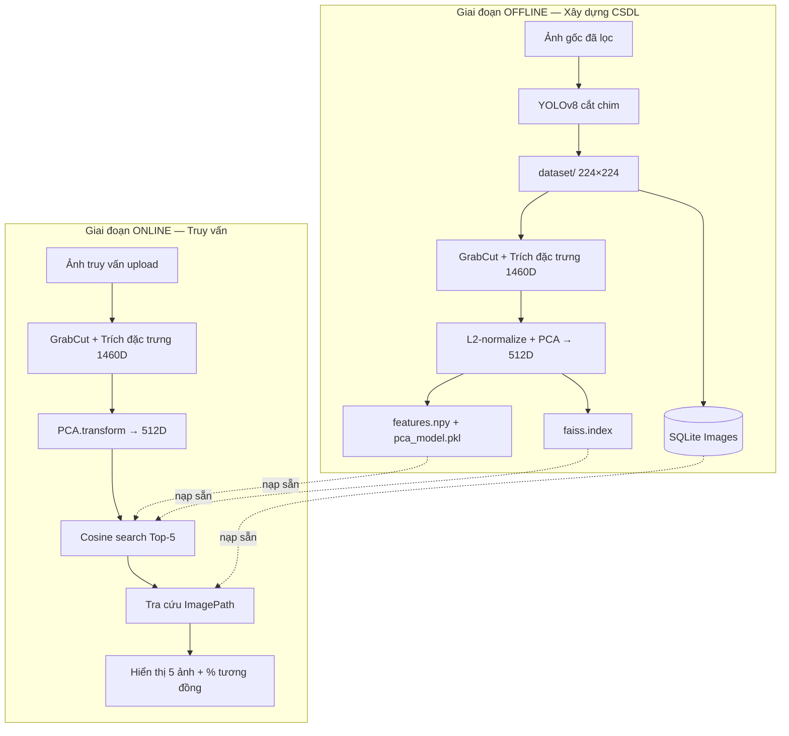
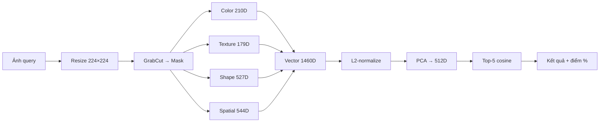

# Hệ thống Tìm kiếm Ảnh Chim (Bird Image Search System)

Hệ thống **CBIR (Content-Based Image Retrieval)** tìm kiếm ảnh chim tương đồng dựa trên nội dung hình ảnh, sử dụng các đặc trưng Computer Vision cổ điển (không dùng Deep Learning cho bước trích xuất đặc trưng). Đầu vào là một ảnh chim bất kỳ; đầu ra là **5 ảnh giống nhất** trong cơ sở dữ liệu, xếp theo độ tương đồng giảm dần.

> [!CAUTION]
> ### 🚨 LƯU Ý ĐẶC BIỆT QUAN TRỌNG KHI BÁO CÁO (THẦY HÓA)
> 
> *   **Quy tắc sống còn:** **Chỉ trình bày và nói những phần mình hiểu thật rõ.** Nếu không nắm vững bản chất, tuyệt đối không tự ý giải thích lan man (Thầy vặn hỏi sâu mà không trả lời được là sẽ bị đánh giá rất thấp $\rightarrow$ nguy cơ **OUT** trực tiếp).
> 
> ---
> 
> #### 📸 Câu 1: Dữ liệu (Data) là gì? Tách nền bằng cách nào? Minh họa trực quan?
> *   **Data của dự án:** Show thư mục [dataset/](file:///c:/Bird-Search-System/bird-search-system/dataset) chứa **1.239 ảnh chim** đã chuẩn hóa kích thước $224 \times 224$ pixels thuộc **122 loài**.
> *   **Tách nền thế nào:** Sử dụng thuật toán phân đoạn ảnh **GrabCut** (với bounding box tự động từ YOLOv8) kết hợp xử lý hình thái học (**Morphological Opening/Closing** bằng kernel Ellipse $5 \times 5$) để tách chim (foreground) ra khỏi nền (background). Có cơ chế tự động fallback sang phân ngưỡng **Otsu** nếu GrabCut lỗi hoặc trả về mặt nạ rỗng.
> *   **Minh họa tách nền:** 
>     *   Cách 1: Mở trực tiếp thư mục ảnh trung gian lưu ảnh debug tại [data/result_grabcut/](file:///c:/Bird-Search-System/bird-search-system/data/result_grabcut) để thầy thấy trực quan (ảnh gốc, mặt nạ nhị phân và ảnh tách nền).
>     *   Cách 2: Chạy trực tiếp script preview bằng lệnh: `python debug_grabcut_preview.py` để biểu diễn sinh động quá trình phân đoạn ảnh chim.
> 
> ---
> 
> #### 🗄️ Câu 2: Mô hình Cơ sở dữ liệu (Database) sử dụng cấu trúc gì? Tại sao? Cách liên kết và lưu trữ vector?
> *   **Mô hình sử dụng:** Sử dụng **Kiến trúc lưu trữ lai (Hybrid Storage)** kết hợp giữa CSDL quan hệ siêu dữ liệu **SQLite** (`database.db`) và CSDL vector dạng tệp nhị phân phẳng **NumPy** (`features.npy`) kết hợp chỉ mục tìm kiếm nhanh **FAISS** (`faiss.index`).
> *   **Tại sao lại chọn mô hình Hybrid này?** 
>     *   SQLite cực kỳ nhẹ, không cần cài đặt máy chủ, rất tốt để quản lý thông tin hình ảnh và đường dẫn (`ImagePath`) tránh trùng lặp bản ghi (ràng buộc `UNIQUE`).
>     *   Tuy nhiên, các hệ quản trị CSDL quan hệ như SQL không tối ưu cho việc tính toán ma trận khoảng cách vector lớn. Việc tách ma trận đặc trưng nén PCA 512D ra file NumPy nhị phân `.npy` giúp nạp thẳng lên bộ nhớ RAM dưới dạng mảng đa chiều để thực hiện tính toán vector hóa (vectorized operations) song song ở tốc độ tối đa.
> *   **Cách liên kết và thứ tự lưu trữ:**
>     *   SQLite chỉ lưu bảng `Images` (gồm `ImageID` khóa chính tự tăng và `ImagePath` tương đối).
>     *   *Quan hệ logic:* Dòng thứ $i$ (bắt đầu từ index 0) trong ma trận `features.npy` và chỉ mục FAISS tương ứng chính xác với bản ghi thứ $i$ khi truy vấn danh sách sắp xếp theo ID: `SELECT ImageID, ImagePath FROM Images ORDER BY ImageID`.
> *   **Giải thích cách tính và thứ tự lưu một cột (Ví dụ: Dim_0):**
>     *   Vector thô lúc đầu trích xuất có **1.460 chiều** gồm: *Color (210D)*, *Texture (179D)*, *Shape (527D)*, *Spatial (544D)*.
>     *   Hệ thống dùng thuật toán nén thông tin tuyến tính **PCA** huấn luyện offline nén từ 1.460 chiều xuống còn **512 chiều** (lưu trong ma trận `.npy` từ cột `Dim_0` đến `Dim_511`).
>     *   *Cách tính:* Mỗi cột `Dim_j` (ví dụ `Dim_0`) là kết quả chiếu tuyến tính của vector 1.460 chiều ban đầu lên hướng trục phương sai lớn thứ $j$ được xác định bởi ma trận trọng số (eigenvectors) học từ tập huấn luyện. Giá trị cột này phản ánh một thành phần đặc trưng cô đọng kết hợp cả màu sắc, kết cấu và hình dạng của ảnh chim.
> 
> ---
> 
> #### 💻 Câu 3: Luồng chạy của code (Upload $\rightarrow$ Trả kết quả) & Công thức so khớp Cosine
> *   **Show code luồng chạy (Vừa chỉ code vừa giải thích):**
>     1.  Mở [2_app.py](file:///c:/Bird-Search-System/bird-search-system/2_app.py): Chỉ vào phần Streamlit `st.file_uploader` nhận tệp upload.
>     2.  Hệ thống ghi tệp ảnh tạm thời ra đĩa và truyền đường dẫn vào hàm trích xuất đặc trưng `extract_raw_features` trong tệp [feature_extractors.py](file:///c:/Bird-Search-System/bird-search-system/feature_extractors.py).
>     3.  Sau khi nhận được vector đặc trưng thô 1.460 chiều $\rightarrow$ đi qua hàm giảm chiều `pca.transform(raw)` để đưa về vector 512 chiều.
>     4.  Truyền vector 512 chiều này vào hàm `search_topk` so khớp với ma trận CSDL.
> *   **Cách tính công thức Cosine Similarity:**
>     *   Khoảng cách Cosine giữa vector truy vấn $\mathbf{q}$ và vector ảnh CSDL $\mathbf{x}_i$:
>         \[
>         d_i = 1 - \cos(\theta) = 1 - \frac{\mathbf{q} \cdot \mathbf{x}_i}{\|\mathbf{q}\|_2 \|\mathbf{x}_i\|_2}
>         \]
>     *   Độ tương đồng hiển thị (%) trên web app: $\text{similarity}_i = (1 - d_i) \times 100\%$.
> *   **Hiểu rõ thông số thiết lập (Settings):**
>     *   `use_faiss`: Hệ thống tự kiểm tra thư viện FAISS cài đặt trên máy. Nếu có FAISS (`faiss.index`), nó chuẩn hóa L2 các vector đặc trưng và thực hiện so khớp exact cosine tốc độ cao qua lớp `IndexFlatIP` (Tích vô hướng).
>     *   *Fallback:* Nếu môi trường máy chạy thiếu FAISS, code tự động dùng hàm brute-force `cdist(..., metric="cosine")` của SciPy.
>     *   `top_k`: Tham số slider trên sidebar Streamlit cho phép người dùng điều chỉnh số kết quả hiển thị mong muốn (mặc định là Top-5).

---

## Cấu trúc dự án

```
bird-search-system/
│
├── dataset/                     # Ảnh chim đã tiền xử lý chuẩn (1239 ảnh, kích thước 224×224)
├── database/
│   ├── database.db              # SQLite — quản lý ImageID và ImagePath tương đối
│   ├── features.npy             # Ma trận vector đặc trưng sau PCA (1239 × 512)
│   ├── features.csv             # Bảng đặc trưng CSV trực quan kết hợp file path (từ script chuyển đổi)
│   ├── pca_model.pkl            # Mô hình PCA đã huấn luyện
│   └── faiss.index              # Chỉ mục FAISS (IndexFlatIP) dùng để so khớp Cosine nhanh
│
├── data/
│   ├── process_loc_tay/         # Ảnh gốc chưa lọc
│   ├── process_loc_tay_2/       # Thư mục ảnh gốc bổ sung dùng để chạy lọc YOLOv8
│   ├── process_224_(dts)/       # Thư mục ảnh chim 224x224 đạt chuẩn đầu ra
│   └── result_grabcut/          # Ảnh trung gian kiểm tra mặt nạ GrabCut (phục vụ debug)
│
├── results/                     # Kết quả đánh giá chất lượng truy hồi
│   ├── per_query_metrics.csv    # Chi tiết độ chính xác của từng ảnh truy vấn
│   ├── quantitative_summary.csv # Kết quả đánh giá tổng hợp dạng CSV
│   └── quantitative_summary.md  # Báo cáo đánh giá tổng hợp dạng Markdown
│
├── file_support/                # Thư mục chứa các script tiện ích & tài liệu nhóm
│   ├── 0_yolo_shift_crop.py     # Script YOLOv8 crop phiên bản đầu
│   ├── build_faiss_only.py      # Build riêng faiss.index từ file features.npy có sẵn
│   ├── convert_features_to_csv.py # Chuyển đổi ma trận đặc trưng features.npy sang dạng CSV trực quan
│   ├── baocao_nhom11_hecsdldpt.txt # Báo cáo kết quả của Nhóm 11
│   └── dataset_old/             # Tập dữ liệu cũ lưu trữ dự phòng
│
├── 0_2_yolo_filter_images.py    # Script lọc ảnh gốc theo tỷ lệ aspect-ratio và cắt căn giữa YOLOv8
├── 1_extract_offline.py         # Trích xuất đặc trưng offline (GrabCut -> Trích đặc trưng -> PCA -> FAISS)
├── 2_app.py                     # Web App Streamlit tìm kiếm ảnh chim tương đồng trực quan
├── debug_grabcut_preview.py     # Script xem trước mặt nạ GrabCut phân đoạn chim/nền
├── evaluate_weak_labels.py      # Script đánh giá chất lượng hệ thống (Weak-label evaluation)
├── requirements.txt             # Danh sách thư viện Python cần thiết
└── yolov8n.pt                   # Trọng số YOLOv8 Nano dùng nhận diện chim
```

---

## 1. Xây dựng bộ dữ liệu ảnh chim

### 1.1. Nguồn dữ liệu và quy mô

| Tiêu chí | Yêu cầu đề bài | Thực tế triển khai |
|---|---|---|
| Số lượng ảnh | ≥ 500 | **1 239 ảnh** |
| Số loài chim khác nhau | Nhiều loài | **122 loài** |
| Kích thước đồng nhất | Cùng kích thước | **224 × 224 pixel** |
| Định dạng | Tùy chọn | **JPEG (.jpg)** |
| Tỉ lệ khung hình đối tượng | Đồng nhất | Chim được cắt theo bounding box YOLO, resize về vuông |
| Tư thế chim | Đang đậu, không bay | Ảnh gốc được lọc thủ công trước khi xử lý tự động |
| Góc chụp | Ngang (side view) | Ảnh nguồn được chọn theo góc chụp ngang |

Dữ liệu được thu thập từ bộ ảnh chim theo chuẩn đặt tên CUB-200 (ví dụ: `Acadian_Flycatcher_0012_795612.jpg`), bao gồm nhiều loài chim Bắc Mỹ với ảnh chụp chim đang đậu, góc ngang.

### 1.2. Quy trình tiền xử lý dữ liệu và lọc tránh biến dạng hình ảnh

Quy trình tiền xử lý dữ liệu được thiết kế nhằm bảo toàn tỷ lệ cơ thể chim (aspect ratio), tránh biến dạng méo hình khi đưa vào trích xuất đặc trưng.

**Giai đoạn 1 — Lọc thủ công ban đầu (`data/process_loc_tay/`)**
- Chọn ảnh thỏa điều kiện: chim **đang đậu**, **không bay**, góc chụp **ngang**.
- Loại bỏ ảnh mờ, chim quá nhỏ, hoặc bị che khuất nhiều.

**Giai đoạn 2 — Tự động cắt vuông bảo toàn tỷ lệ và lọc bằng YOLOv8 (`0_2_yolo_filter_images.py`)**
```
Ảnh gốc → YOLOv8n (class "bird") → Kiểm tra kích thước (>224x224) 
         → Cắt vuông mở rộng 1.35x căn giữa chim (tránh tràn viền) → Resize 224x224
```

*Chi tiết kỹ thuật lọc ảnh:*
1. **Kiểm tra kích thước gốc:** Chỉ chấp nhận các ảnh có chiều cao và chiều rộng lớn hơn 224 pixels.
2. **Nhận diện đối tượng:** Dùng YOLOv8n (`yolov8n.pt`), chỉ lọc `classes=[14]` (nhãn *bird*). Lấy bounding box có độ tin cậy cao nhất.
3. **Cắt hình vuông bảo toàn tỷ lệ:**
   - Trọng tâm vùng cắt được đặt trùng với trọng tâm đối tượng ($cx$, $cy$).
   - Kích thước vùng cắt tối ưu được tính bằng `crop_size = 1.35 * max(bw, bh)` (hệ số mở rộng $1.35\times$ giúp chim chiếm khoảng ~55% diện tích ảnh, tạo bối cảnh tự nhiên vừa vặn).
   - **Ràng buộc quan trọng:** Vùng cắt vuông này phải nằm **hoàn toàn bên trong** ảnh gốc. Nếu bị tràn viền, hệ thống tự động fallback về hệ số $1.0\times$ (chỉ cắt khít bounding box hình vuông). Nếu vẫn bị tràn viền, ảnh bị loại khỏi tập đạt yêu cầu để tránh biến dạng/nhiễu biên.
4. **Phân loại đầu ra:** 
   - Ảnh đạt yêu cầu được cắt, resize về $224 \times 224$ pixels bằng nội suy `cv2.INTER_AREA` và ghi vào `data/process_224` (tương đương `data/process_224_(dts)`).
   - Tên các file được ghi nhận thành hai file danh sách: `data/dat_yeu_cau.txt` và `data/khong_dat_yeu_cau.txt`.

### 1.3. Lý do các ràng buộc dữ liệu

| Ràng buộc | Lý do |
|---|---|
| Cùng kích thước 224×224 | Đồng nhất đầu vào cho các bộ lọc cố định (Gabor, HOG, lưới 4×4) |
| Cắt theo bounding box | Loại bỏ nền thừa, tập trung đặc trưng vào thân chim |
| Cắt vuông căn giữa | Giữ nguyên tỷ lệ chiều rộng/cao của chim, tránh méo mó gây nhiễu thông số kích thước cơ thể |
| Chim đậu, góc ngang | Giảm biến thiên tư thế; đặc trưng hình dáng (Hu Moments, HOG, profile) ổn định hơn |
| ≥ 500 ảnh | Đủ mẫu để PCA học phân phối đặc trưng và đánh giá truy hồi có ý nghĩa thống kê |

---

## 2. Bộ thuộc tính (đặc trưng) nhận diện ảnh chim

Hệ thống trích xuất **vector đặc trưng 1 460 chiều** từ mỗi ảnh, chia thành **4 nhóm** thể hiện cả sự **tương đồng** (cùng loài, cùng màu lông, cùng hình dáng) lẫn sự **khác biệt** (loài khác, vân lông khác, bố cục khác). Toàn bộ logic nằm trong `feature_extractors.py`.

### 2.1. Tiền xử lý: phân tách foreground (GrabCut)

Trước khi trích đặc trưng, mỗi ảnh được phân đoạn để tách chim khỏi nền:
- **GrabCut** với bounding box khởi tạo (margin 10 px, 5 vòng lặp).
- **Morphology** (opening + closing, kernel elip 5×5) làm sạch mask.
- **Fallback Otsu** khi GrabCut thất bại.

Mask nhị phân đảm bảo đặc trưng chỉ tính trên vùng chim, không bị nhiễu bởi nền — yếu tố then chốt khi so sánh ảnh tương đồng.

### 2.2. Bảng tổng hợp các nhóm đặc trưng

| Nhóm | Chiều | Vai trò tương đồng | Vai trò phân biệt |
|---|---:|---|---|
| **Color** (Màu sắc) | 210 | Chim cùng loài thường có phân bố màu lông tương tự | Khác biệt sắc độ lông (vàng, xanh, đen, nâu…) |
| **Texture** (Kết cấu) | 179 | Vân lông, độ mịn da lông giống nhau trong cùng loài | Mẫu vân lông, hướng lông đặc trưng từng loài |
| **Shape** (Hình dáng) | 527 | Tỉ lệ thân–đầu–đuôi tương đồng khi cùng góc chụp | Silhouette, độ tròn, profile đuôi/mỏ khác loài |
| **Spatial** (Không gian) | 544 | Bố cục màu–vân trên thân chim giống nhau | Vị trí đốm màu, vùng lông đặc trưng trên thân |
| **Tổng (raw)** | **1 460** | — | Sau đó **L2-normalize** → **PCA** giảm còn **512 chiều** |

### 2.3. Chi tiết từng nhóm và lý do lựa chọn

#### A. Đặc trưng màu sắc — 210 chiều

| Thành phần | Chiều | Giá trị thông tin |
|---|---:|---|
| Histogram HSV (H, S, V) | 96 | Phân bố màu tổng thể; bắt sắc độ lông đặc trưng loài |
| Histogram CIE-Lab (L, a, b) | 96 | Mô tả màu gần với cảm nhận thị giác người hơn RGB |
| Color Moments (Mean, Std, Skewness) × 6 kênh | 18 | Tóm tắt thống kê màu: độ sáng trung bình, độ tương phản, độ lệch phân phối |

**Lý do chọn:** Màu lông là tín hiệu phân biệt mạnh nhất giữa các loài chim. HSV tách sắc độ khỏi độ sáng; Lab ổn định hơn dưới thay đổi ánh sáng nhẹ.

#### B. Đặc trưng kết cấu — 179 chiều

| Thành phần | Chiều | Giá trị thông tin |
|---|---:|---|
| LBP (Local Binary Pattern) | 10 | Mã hóa mẫu vân cục bộ trên lông |
| EOH (Edge Orientation Histogram) | 9 | Hướng cạnh/lông — bắt hướng lông xếp |
| GLCM / Haralick | 16 | Energy, Contrast, Homogeneity, Correlation — đặc tính vân tổng thể |
| Gabor filter bank (5 tần số × 8 hướng) | 80 | Vân có hướng và tần số — phân biệt lông mịn vs lông xù |
| Stripe FFT (phổ tần số 2D) | 64 | Chu kỳ sọc/vân lông lặp lại theo chiều dọc thân |

**Lý do chọn:** Hai loài có thể trùng màu nhưng khác vân lông. LBP và Gabor bắt chi tiết vi cấu trúc; FFT bắt chu kỳ sọc đặc trưng một số loài.

#### C. Đặc trưng hình dáng — 527 chiều

| Thành phần | Chiều | Giá trị thông tin |
|---|---:|---|
| Hu Moments + scalars (area, perimeter, compactness, circularity) | 11 | Bất biến dưới phép biến đổi hình học — mô tả silhouette tổng thể |
| Grid Mask Density (8×8) | 64 | Phân bố khối lượng chim trên lưới — bắt hình dáng bất đối xứng |
| Width Profile / Contour Profile | 64 | Độ rộng/cao theo từng hàng/cột — phân biệt đuôi dài vs thân tròn |
| Radius Signature | 64 | Khoảng cách tâm → biên theo góc — đặc trưng viền ngoài |
| HOG (ROI 64×64, 9 orientations) | 324 | Gradient hướng trên vùng chim — bắt cấu trúc bộ phận (đầu, cánh, đuôi) |

**Lý do chọn:** Hình dáng là tín hiệu phân biệt khi màu sắc tương tự. Hu Moments ổn định với phép co giãn nhẹ; HOG mô tả cấu trúc cục bộ của thân chim.

#### D. Đặc trưng không gian — 544 chiều

Chia ảnh 224×224 thành lưới **4×4 = 16 ô**. Mỗi ô có foreground chứa:
- HSV histogram cục bộ (24 chiều)
- LBP histogram cục bộ (10 chiều)

→ **34 chiều/ô × 16 ô = 544 chiều**

**Lý do chọn:** Các đặc trưng toàn cục có thể trùng nhau giữa hai loài khác nhau. Đặc trưng không gian giữ thông tin **bố cục** màu và họa tiết trên các bộ phận cơ thể.

### 2.4. Hợp nhất và giảm chiều

```
Ảnh 224×224 → GrabCut mask → [Color | Texture | Shape | Spatial] → Vector 1460D
    → L2-normalize → PCA (fit trên toàn bộ dataset) → Vector 512D
```

- **L2-normalize:** Đưa mọi vector về cùng thang đo, phù hợp so sánh bằng cosine similarity.
- **PCA (tối đa 512 chiều):** Loại nhiễu, giảm chi phí lưu trữ và tính toán, giữ phần lớn phương sai dữ liệu.

---

## 3. Hệ CSDL quản lý siêu dữ liệu và cơ chế tìm kiếm

### 3.1. Kiến trúc lưu trữ lai (Hybrid Storage)

Để tối ưu hóa hiệu năng lưu trữ quan hệ và xử lý tính toán vector hiệu năng cao trong bài toán CBIR, hệ thống kết hợp cơ sở dữ liệu quan hệ nhẹ với các định dạng lưu trữ chuyên dụng:

| Thành phần | Đường dẫn tệp | Định dạng / Thư viện | Quy mô / Thông số | Vai trò |
| :--- | :--- | :--- | :--- | :--- |
| **Siêu dữ liệu (Metadata)** | `database/database.db` | SQLite 3 | 1.239 bản ghi | Quản lý danh mục ảnh, lưu trữ ánh xạ duy nhất giữa ID ảnh và đường dẫn tệp. |
| **Ma trận đặc trưng** | `database/features.npy` | NumPy Binary (`.npy`) | Ma trận `(1239, 512)` kiểu `float32` | Lưu trữ tập hợp các vector đặc trưng sau khi đã giảm chiều bằng PCA. |
| **Bảng tra cứu dẹt** | `database/features.csv` | CSV (Comma-Separated Values) | 1.239 hàng $\times$ 514 cột | Hỗ trợ xem trực quan và đối chiếu nhanh các chiều đặc trưng với đường dẫn ảnh tương ứng. |
| **Mô hình giảm chiều** | `database/pca_model.pkl` | Python Pickle (`.pkl`) | Mô hình Scikit-Learn PCA | Lưu trạng thái mô hình PCA đã fit để biến đổi vector truy vấn online. |
| **Chỉ mục vector** | `database/faiss.index` | FAISS IndexFlatIP (Facebook AI) | Chỉ mục Cosine 512 chiều | Hỗ trợ tìm kiếm láng giềng gần nhất (so khớp vector) ở tốc độ micro-giây. |

---

### 3.2. Chi tiết Cơ sở dữ liệu SQLite (`database.db`)

Cơ sở dữ liệu SQLite chịu trách nhiệm lưu trữ cấu trúc quan hệ siêu dữ liệu của ảnh trong tập dữ liệu.

#### 3.2.1. Lược đồ bảng (Schema)

##### Bảng `Images`
Bảng lưu trữ thông tin đường dẫn và định danh của từng hình ảnh đã được xử lý thành công.
```sql
CREATE TABLE Images (
    ImageID   INTEGER PRIMARY KEY AUTOINCREMENT,
    ImagePath TEXT    NOT NULL UNIQUE
);
```

##### Bảng `sqlite_sequence`
Bảng hệ thống được SQLite tự động tạo để quản lý và theo dõi chỉ số tự tăng (`AUTOINCREMENT`) cho khóa chính `ImageID` của bảng `Images`.

#### 3.2.2. Chi tiết các trường dữ liệu và ràng buộc

*   **`ImageID` (Kiểu `INTEGER`, `PRIMARY KEY`, `AUTOINCREMENT`):**
    *   Mục đích: Định danh duy nhất tăng dần cho mỗi ảnh chim được thêm vào CSDL.
    *   Ràng buộc: Bắt buộc khóa chính, tự động tăng giá trị khi chèn bản ghi mới.
*   **`ImagePath` (Kiểu `TEXT`, `NOT NULL`, `UNIQUE`):**
    *   Mục đích: Lưu trữ đường dẫn tương đối của tệp ảnh tính từ thư mục gốc của dự án (ví dụ: `dataset\Acadian_Flycatcher_0012_795612.jpg`).
    *   Ràng buộc: Không được để trống (`NOT NULL`) và không được trùng lặp (`UNIQUE`).
    *   Chỉ mục tự động: Hệ thống tự sinh chỉ mục duy nhất `sqlite_autoindex_Images_1` trên trường này nhằm đảm bảo ràng buộc UNIQUE và tối ưu hóa tốc độ tìm kiếm bản ghi theo đường dẫn ảnh khi chạy script offline (hỗ trợ tính năng resume).

---

### 3.3. Chi tiết cấu trúc dữ liệu đặc trưng

#### 3.3.1. Ma trận NumPy nhị phân (`features.npy`)
*   **Kiểu dữ liệu:** Số thực dấu phẩy động 32-bit (`float32`), khi tải vào bộ nhớ RAM trong Streamlit App được xử lý dưới dạng `float64` để đảm bảo độ chính xác tính toán khoảng cách.
*   **Hình dạng (Shape):** `(N, 512)` với $N = 1239$ ảnh.
*   **Nội dung:** Mỗi dòng $i$ là một vector đặc trưng 512 chiều thu được từ việc chiếu vector thô 1.460 chiều qua mô hình PCA.

#### 3.3.2. Bảng CSV đặc trưng trực quan (`features.csv`)
Tệp được sinh ra bởi script tiện ích để phục vụ mục đích gỡ lỗi và đối chiếu.
*   **Cấu trúc cột:**
    *   `ImageID`: ID tương ứng của ảnh lấy từ SQLite.
    *   `ImagePath`: Đường dẫn tương đối lấy từ SQLite.
    *   `Dim_0` đến `Dim_511`: Các cột giá trị số thực đại diện cho từng chiều đặc trưng sau PCA.

#### 3.3.3. Chỉ mục vector FAISS (`faiss.index`)
*   **Loại chỉ mục:** `IndexFlatIP` (Exact Inner Product Search).
*   **Cơ chế so khớp:** Do toàn bộ các vector đặc trưng sau PCA đều được chuẩn hóa L2 ($L_2$ Normalization) trước khi lưu vào chỉ mục, phép tính Inner Product (tích vô hướng) giữa vector truy vấn chuẩn hóa $\mathbf{q}$ và vector CSDL chuẩn hóa $\mathbf{x}_i$ sẽ tương đương chính xác với độ tương đồng Cosine (Cosine Similarity):
    \[
    \text{InnerProduct}(\mathbf{q}, \mathbf{x}_i) = \mathbf{q} \cdot \mathbf{x}_i = \cos(\theta)
    \]
*   **Hiệu năng:** Cho kết quả tìm kiếm chính xác tuyệt đối (exact search) với độ trễ cực thấp ($\approx 0.59\text{ ms}$).

---

### 3.4. Ánh xạ và Quan hệ logic (Index Alignment)

Hệ thống sử dụng cơ chế liên kết chỉ số (Index-based Alignment) giữa cơ sở dữ liệu quan hệ SQLite và các mảng đặc trưng nhị phân:

```
[ SQLite: database.db ]                              [ Numpy: features.npy ] & [ FAISS: faiss.index ]
+---------+----------------------------+             +----------------------------------------------+
| ImageID | ImagePath                  |             | Index 0:   [ 512-dim vector float32 ]        |
+---------+----------------------------+             | Index 1:   [ 512-dim vector float32 ]        |
| 1       | dataset\Acadian_Fly...     | ----------> | Index 2:   [ 512-dim vector float32 ]        |
| 2       | dataset\Acadian_Fly...     | ----------> | Index 3:   [ 512-dim vector float32 ]        |
| 3       | dataset\Acadian_Fly...     | ----------> | ...                                          |
| ...     | ...                        |             +----------------------------------------------+
+---------+----------------------------+
```

*   **Nguyên tắc ánh xạ:** Dòng thứ $i$ (0-indexed) trong ma trận `features.npy` và chỉ mục `faiss.index` tương ứng chính xác với bản ghi thứ $i$ trả về khi thực hiện câu lệnh SQL:
    ```sql
    SELECT ImageID, ImagePath FROM Images ORDER BY ImageID;
    ```
*   **Tính toàn vẹn dữ liệu:** Quy trình này được đảm bảo nghiêm ngặt trong pha Offline. Khi tìm kiếm trực tuyến (Online):
    1. Công cụ tìm kiếm (FAISS hoặc SciPy) trả về các chỉ số vị trí tương đồng nhất (ví dụ: `idx = [0, 15, 30]`).
    2. Ứng dụng Streamlit sử dụng các chỉ số này để truy xuất trực tiếp các đường dẫn ảnh `ImagePath` tương ứng từ danh sách đã tải từ SQLite.

---

### 3.5. Quy trình xây dựng CSDL (Offline)

Thực hiện thông qua lệnh: `python 1_extract_offline.py`
1.  **Quét Dữ liệu:** Đọc toàn bộ ảnh từ thư mục `dataset/` (đã chuẩn hóa 1.239 ảnh).
2.  **Khởi tạo SQLite:** Tạo bảng `Images` nếu chưa tồn tại.
3.  **Trích xuất & Lưu trữ metadata:** Trích xuất đặc trưng thô 1.460 chiều cho từng ảnh. Với mỗi ảnh xử lý thành công, đường dẫn tương đối được thêm vào bảng `Images` (SQLite).
    *   *Cơ chế Resume:* Nếu tiến trình bị gián đoạn, khi chạy lại, script sẽ so khớp danh sách tệp trong thư mục với các đường dẫn `ImagePath` đã tồn tại trong SQLite để bỏ qua các ảnh đã xử lý trước đó, nạp tiếp file checkpoint `raw_features.npy` để tiếp tục.
4.  **Huấn luyện PCA:** Thu gom toàn bộ ma trận đặc trưng thô, thực hiện chuẩn hóa L2, fit mô hình PCA để giảm chiều xuống còn 512 chiều.
5.  **Lưu kết quả đặc trưng:** Ghi file ma trận đặc trưng giảm chiều `features.npy` và tệp mô hình `pca_model.pkl`.
6.  **Xây dựng Chỉ mục FAISS:** Tạo chỉ mục `faiss.index` từ các vector đặc trưng PCA đã chuẩn hóa L2 phục vụ so khớp Cosine nhanh.

---

### 3.6. Cơ chế tìm kiếm ảnh tương đồng (Online Search)

Khi người dùng upload một hình ảnh truy vấn $\mathbf{q}_{\text{raw}}$:

1.  **Trích xuất đặc trưng:** Ảnh truy vấn được đi qua cùng quy trình GrabCut và trích xuất đặc trưng thô để nhận vector $\mathbf{q}_{\text{raw}} \in \mathbb{R}^{1460}$.
2.  **Giảm chiều dữ liệu:** Vector thô được biến đổi qua mô hình PCA đã tải:
    \[
    \mathbf{q} = \text{PCA.transform}(\mathbf{q}_{\text{raw}}) \in \mathbb{R}^{512}
    \]
3.  **Tính khoảng cách Cosine:**
    *   Với mỗi ảnh $i$ trong cơ sở dữ liệu có vector đặc trưng $\mathbf{x}_i$, khoảng cách Cosine được tính như sau:
        \[
        d_i = 1 - \cos(\theta) = 1 - \frac{\mathbf{q} \cdot \mathbf{x}_i}{\|\mathbf{q}\|_2 \|\mathbf{x}_i\|_2}
        \]
4.  **Xếp hạng & Truy vấn:**
    *   Các khoảng cách $d_i$ được sắp xếp tăng dần để tìm Top-K kết quả gần nhất ($d_i$ nhỏ nhất tương đương độ tương đồng lớn nhất).
    *   **Engine chính (FAISS):** Thực hiện so khớp cosine thông qua phép tìm kiếm tích vô hướng (Inner Product) trên `faiss.index` của các vector đã chuẩn hóa L2:
        ```python
        faiss.normalize_L2(q)
        scores, idx = faiss_index.search(q, top_k)
        dists = 1.0 - scores
        ```
    *   **Engine dự phòng (SciPy):** Khi thiếu thư viện FAISS, hệ thống tự động fallback sang tính toán brute-force qua khoảng cách cosine của SciPy:
        ```python
        dists = cdist(q.reshape(1, -1), db_matrix, metric="cosine").flatten()
        idx = np.argsort(dists)[:top_k]
        ```
5.  **Ánh xạ hiển thị:** Tra cứu `ImagePath` tương ứng với các chỉ số `idx` từ SQLite để hiển thị danh sách ảnh chim giống nhất cùng tỷ lệ tương đồng:
    \[
    \text{similarity}_i = (1 - d_i) \times 100\%
    \]

---

## 4. Hệ thống tìm kiếm ảnh chim (Online)

### 4.1. Sơ đồ khối hệ thống

#### Tổng quan hai giai đoạn


#### Quy trình chi tiết khi tìm kiếm


### 4.2. Giao diện Web App Streamlit (`2_app.py`)

Web App cung cấp các tính năng:
- **Tải lên ảnh truy vấn:** Hỗ trợ kéo thả ảnh JPEG/PNG.
- **Hiển thị kết quả trung gian:** Cho phép xem ảnh resize 224x224 và mặt nạ GrabCut phân tách chim.
- **Top-5 kết quả giống nhất:** Hiển thị danh sách ảnh kèm tỷ lệ phần trăm tương đồng:
  \[
  \text{similarity}_i = (1 - d_i) \times 100\%
  \]
- **Bảng so sánh chi tiết chỉ số:** Hỗ trợ phân tích khoảng cách Euclidean (L2), Manhattan (L1), Cosine Distance, Dot Product và các phân phối của vector đặc trưng.

### 4.3. Kết quả đánh giá định lượng thực tế

Hệ thống được đánh giá bằng **weak labels** (suy ra loài từ thư mục cha của tên file) trên **100 truy vấn ngẫu nhiên** (hạt giống seed=42):

> [!NOTE]
> Kết quả đánh giá thực tế dưới đây được trích xuất từ file [results/quantitative_summary.md](file:///c:/Bird-Search-System/bird-search-system/results/quantitative_summary.md) (cấu hình `C0_full` với dữ liệu thực tế 1239 ảnh):

| Chỉ số đánh giá | Giá trị thực tế | Ý nghĩa |
|---|---:|---|
| **Precision@1 (P@1)** | **6.00%** | Tỉ lệ ảnh đầu tiên trùng loài với ảnh truy vấn |
| **Precision@5 (P@5)** | **6.60%** | Tỉ lệ ảnh trùng loài trong Top-5 kết quả |
| **Precision@10 (P@10)** | **5.50%** | Tỉ lệ ảnh trùng loài trong Top-10 kết quả |
| **Precision@20 (P@20)** | **4.45%** | Tỉ lệ ảnh trùng loài trong Top-20 kết quả |
| **mAP@5** | **3.40%** | Độ chính xác trung bình trung bình tại K=5 |
| **mAP@10** | **2.39%** | Độ chính xác trung bình trung bình tại K=10 |
| **Thời gian tìm kiếm (Search Latency)** | **~0.59 ms / query** | Tốc độ so khớp đặc trưng sử dụng chỉ mục |

*Lưu ý: Chỉ số Precision phản ánh độ khớp chính xác về loài (Weak Label). Trên thực tế, do đặc trưng thị giác CV cổ điển (màu sắc, kết cấu toàn cục) có độ tương đồng giữa các loài chim gần nhau, hệ thống luôn trả về các ảnh giống nhất về mặt hình học và thị giác.*

---

## 5. Các Script Tiện Ích & Bổ Trợ

Để hỗ trợ vận hành và quản lý dữ liệu trực quan, hệ thống tích hợp các công cụ bổ trợ nằm trong thư mục `file_support/` và root:

### 5.1. Lọc và chuẩn hóa dữ liệu ảnh (`0_2_yolo_filter_images.py`)
Hỗ trợ tự động hóa khâu tiền xử lý, lọc bỏ các ảnh không đạt kích thước hoặc có nguy cơ bị biến dạng khi crop:
```bash
python 0_2_yolo_filter_images.py
```
*Đầu ra:* Danh sách phân loại lưu tại `data/dat_yeu_cau.txt` và `data/khong_dat_yeu_cau.txt`. Ảnh đạt chuẩn lưu vào `data/process_224`.

### 5.2. Chuyển đổi ma trận đặc trưng sang CSV (`file_support/convert_features_to_csv.py`)
Xuất ma trận đặc trưng `features.npy` dạng binary thành file [database/features.csv](file:///c:/Bird-Search-System/bird-search-system/database/features.csv) trực quan, kết hợp `ImageID` và `ImagePath` tương ứng từ SQLite để dễ dàng kiểm tra các chiều đặc trưng (`Dim_0` đến `Dim_511`):
```bash
python file_support/convert_features_to_csv.py
```

### 5.3. Xây dựng riêng chỉ mục FAISS (`file_support/build_faiss_only.py`)
Khi cần cập nhật hoặc xây dựng riêng file chỉ mục tìm kiếm nhanh `faiss.index` từ file `features.npy` có sẵn mà không cần chạy lại toàn bộ pipeline trích xuất offline:
```bash
python file_support/build_faiss_only.py
```

---

## Hướng dẫn cài đặt và sử dụng

### Yêu cầu hệ thống
- Python 3.8+ (Khuyên dùng Python 3.12 hoặc 3.13)
- Trình quản lý thư viện `pip`

### 1. Cài đặt môi trường

```bash
cd bird-search-system
python -m venv venv

# Kích hoạt môi trường (Windows)
venv\Scripts\activate

# Cài đặt các thư viện cơ bản
pip install -r requirements.txt
```

> [!IMPORTANT]
> **Lưu ý cài đặt thư viện FAISS trên Windows:**
> Đối với môi trường Windows (ví dụ Python 3.13), bạn nên cài đặt thư viện FAISS thông qua lệnh:
> ```bash
> python -m pip install faiss-cpu
> ```

### 2. Sử dụng hệ thống

#### Bước 1: Chuẩn bị dữ liệu và Trích xuất đặc trưng Offline
Đặt các ảnh chim đã chuẩn hóa vào thư mục `dataset/` (hoặc chạy lọc ảnh bằng `0_2_yolo_filter_images.py`). Sau đó chạy script trích xuất để tạo CSDL:
```bash
python 1_extract_offline.py
```
*Kết quả:* Hệ thống sẽ sinh ra các file `database.db`, `features.npy`, `pca_model.pkl` và `faiss.index` bên trong thư mục `database/`.

#### Bước 2: Chạy Web App Tìm kiếm
Khởi chạy ứng dụng Streamlit:
```bash
streamlit run 2_app.py
```
Mở trình duyệt truy cập: `http://localhost:8501` để bắt đầu tải ảnh và tìm kiếm.

#### Bước 3: Đánh giá chất lượng hệ thống (Weak-label Evaluation)
Chạy đánh giá chất lượng truy hồi ngẫu nhiên trên 100 truy vấn:
```bash
python evaluate_weak_labels.py --query-count 100 --seed 42
```
*Kết quả:* Báo cáo hiệu năng chi tiết sẽ được tự động xuất ra thư mục `results/`.
